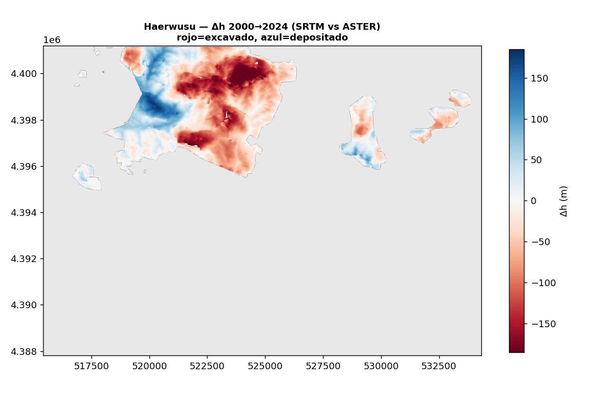
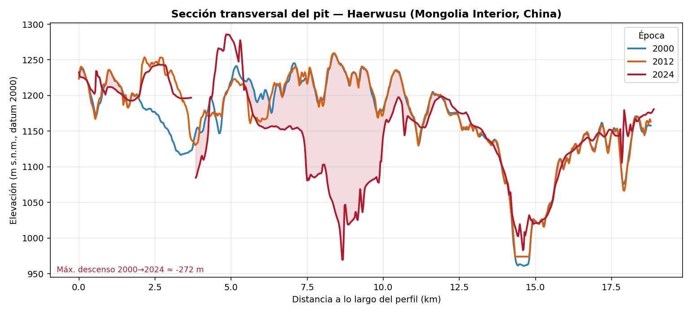

# Caso opaco: Haerwusu (Mongolia Interior, China)

El mismo DEM-differencing, ahora sobre **Haerwusu** (哈尔乌素), en el carbonífero de Jungar (Ordos, Mongolia
Interior): la **mayor mina de carbón a cielo abierto de China**, de Shenhua Group, en producción desde
**octubre de 2008**. Acá no hay tabla pública año a año de mineral/estéril como en Veladero — el satélite pasa
a ser **la medida independiente** del ritmo de extracción.

!!! tip "Mismo truco free que Veladero"
    Haerwusu arrancó en 2008, así que el **SRTM 2000** capta la estepa casi intacta y el **GLO-30 (~2012)** el
    pit ya abierto. El AOI incluye también el pit vecino **Heidaigou** (en operación desde 1999). Ambos DEM,
    gratuitos. El co-registro dio un sesgo de **+0,08 m** (terreno llano, los DEM concuerdan casi perfecto).

## Resultado (2000 → ~2012)

{ loading=lazy }

<iframe src="../assets/demo_volumen_china.html" width="100%" height="540" style="border:1px solid #ccc;border-radius:6px"></iframe>

*Rojo = excavado, azul = depositado (escombreras). Se ven el gran pit de Haerwusu/Heidaigou (−150 a −200 m) y
un pit menor al este. Acotado al footprint minero de OpenStreetMap (incluye el polígono del 准格尔煤田,
"carbonífero de Jungar").*

| Métrica | Valor |
|---|---|
| **Excavado** | **≈ 480 Mm³** |
| **Depositado** (dentro del footprint) | ≈ 118 Mm³ |
| **Neto** (excavado − depositado) | ≈ **−362 Mm³** de remoción |
| Footprint | 56.956 celdas (~37 km², celda 26×26 m) |
| Co-registro | sesgo +0,08 m (insignificante) |

A diferencia de Veladero (donde excavado ≈ depositado, todo dentro del footprint), acá hay **remoción neta
grande**: el **carbón se extrae y se va** (se quema, no se apila), y parte del estéril se deposita **fuera**
del polígono. Es la firma volumétrica de una mina de carbón.

## Hasta 2024 con ASTER (mismo método que el caso público)

Reconstruyendo el DEM de **2024** desde el par estéreo de ASTER (escena del **2024-04-25, 0% nube**,
`aster_dem.sh`) y restándolo contra el SRTM 2000:

{ loading=lazy }

<iframe src="../assets/demo_volumen_china2024.html" width="100%" height="540" style="border:1px solid #ccc;border-radius:6px"></iframe>

| Ventana | Excavado | Neto | DEM reciente |
|---|---|---|---|
| 2000 → **2012** | ≈ 480 Mm³ | ≈ −362 Mm³ | Copernicus GLO-30 |
| 2000 → **2024** | **≈ 1.742 Mm³** | ≈ **−1.151 Mm³** | ASTER 3N/3B → ASP |

El pit **se expandió enormemente** entre 2012 y 2024 (el excavado se multiplicó ×3,6): el área roja pasó de
un foco al NO a cubrir casi todo el norte del footprint. Es la firma de uno de los complejos de carbón de
**crecimiento más rápido del mundo** — visible solo por satélite, porque el dato operativo fino no es público.
El co-registro absorbió un sesgo de −30,5 m (offset geoide/elipsoide SRTM vs ASTER).

## Evolución del pit en el tiempo

Las tres épocas (SRTM 2000, GLO-30 ~2012, ASTER 2024), co-registradas. La **sección transversal** por el
punto más profundo:

{ loading=lazy }

*Entre 2012 (naranja) y 2024 (rojo) el frente de excavación baja fuerte (hasta ~−270 m). El perfil es más
irregular que en Veladero: ASTER es más ruidoso y el paisaje de carbón tiene pits y escombreras que se
mueven. En el terreno estable las curvas vuelven a coincidir.*

**Slider** del Δh acumulado vs 2000 (2000 → 2012 → 2024):

<iframe src="../assets/demo_timeline_china.html" width="100%" height="520" style="border:1px solid #ccc;border-radius:6px"></iframe>

## Cruce con lo poco que se reporta

Convirtiendo el volumen a masa (carbón+roca, ρ ~1,8–2,2 t/m³): **≈ 480 Mm³ → ~860–1.060 Mt** de material
removido de los pits entre 2000 y ~2012.

Para contexto: Haerwusu tiene capacidad **aprobada de 35 Mtpa** de carbón (real ~20–27 Mtpa) y Heidaigou
~30 Mtpa. El **carbón** es solo una fracción de lo movido —el grueso es **estéril** (alto *strip ratio*)—, así
que ~1.000 Mt de material total sobre ~12 años (Heidaigou) más ~4 años (Haerwusu) es del orden esperado.

!!! danger "La opacidad es el punto"
    No existe un dataset público de mineral/estéril año a año para estas minas (a diferencia del *technical
    report* de Veladero). Acá el DEM-diff **no se valida contra el dato fino porque ese dato no es público** —
    y eso es exactamente lo que hace valioso al método: una medición **independiente y verificable** del
    material removido, a partir de satélites gratuitos, donde el reporte oficial no transparenta los números.

## Estado

- [x] Elegir mina y AOI (**Haerwusu**, `SITE=china` en `aoi.py`).
- [x] Bajar SRTM 2000 + GLO-30 ~2012 (`SITE=china python fetch_dems.py`).
- [x] Footprint desde OSM (`overlay_china.geojson`) y `dem_diff.py` con co-registro.
- [x] **DEM reciente de ASTER 2024** (`aster_dem.sh`) → ventana 2000→2024 (`SITE=china2024`).
- [ ] Datar la expansión del pit con Sentinel-2 (óptico) año a año para la tasa anual.
