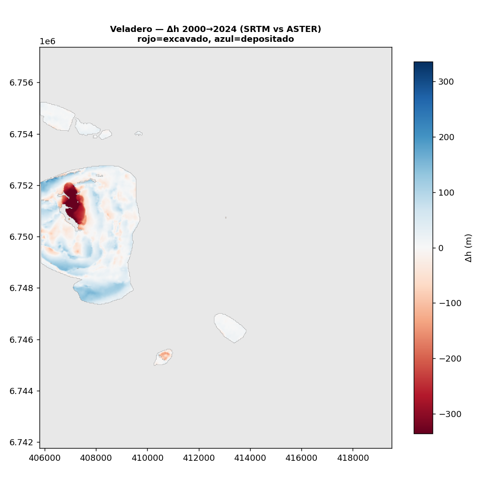

# Caso público: Veladero (San Juan, Argentina)

El caso **público** elegido: **Veladero**, oro/plata a cielo abierto operado por Minera Argentina Gold
(JV **Barrick** 50% / **Shandong Gold** 50%), a ~4.000–4.850 m en la cordillera de San Juan. Dos pits
(**Filón Federico** y **Amable**). La empresa **reporta producción**, lo que permite contrastar el volumen
movido estimado por DEM-diff contra el **material declarado**.

!!! tip "Por qué Veladero es el caso ideal para datos gratuitos"
    La producción arrancó en **2005**. Entonces el **SRTM de febrero de 2000** capta la montaña **prístina**
    (pre-mina) y el **Copernicus GLO-30 (~2012)** capta los pits ya excavados. La diferencia es **enorme y
    limpia** — y ambos DEM son **gratuitos**. No hace falta DEM comercial para este período.

## Resultado (2000 → 2012)

| Métrica | Valor |
|---|---|
| **Excavado** | **≈ 285 Mm³** |
| **Depositado** | ≈ 267 Mm³ |
| Material movido (≈ excavado × 2,5 t/m³) | **≈ 700 Mt** en ~7 años |

El [mapa de Δh](resultados.md) muestra los dos pits (−200 a −320 m) y las escombreras adyacentes (hasta
+150 m). Ver [Resultados](resultados.md) para el detalle y los *caveats*.

## Extender a 2024 con ASTER (estéreo óptico, también gratis)

El GLO-30 frena la ventana en ~2012. Para llegar a **hoy** sin DEM comercial, reconstruimos un DEM **de 2024**
desde el **par estéreo óptico de ASTER** (bandas 3N nadir + 3B backward), gratis vía NASA Earthdata, con
**Ames Stereo Pipeline** (`aster_dem.sh`). Escena del **2024-03-19, 0% de nube**.

{ loading=lazy }

<iframe src="../assets/demo_volumen_veladero2024.html" width="100%" height="540" style="border:1px solid #ccc;border-radius:6px"></iframe>

| Ventana | Excavado | Depositado | Fuente del DEM reciente |
|---|---|---|---|
| 2000 → **2012** | ≈ 285 Mm³ | ≈ 267 Mm³ | Copernicus GLO-30 |
| 2000 → **2024** | **≈ 424 Mm³** | ≈ 497 Mm³ | **ASTER 3N/3B → ASP** |

El pit es **mucho más profundo** en 2024 (mínimo Δh ≈ **−580 m** vs −320 m en 2012) y las escombreras + pila de
lixiviación crecieron mucho (por eso el depositado supera al excavado: Veladero es **heap-leach**, acumula
mineral chancado en superficie). El co-registro absorbió un sesgo de **+29 m** (offset geoide EGM96 del SRTM
vs elipsoide WGS84 del ASTER).

!!! note "Qué demuestra esto"
    Que se puede tener un DEM **reciente y gratuito** a partir de **imágenes 2D** (estéreo óptico satelital) y
    cerrar la ventana hasta el presente. ASTER es más **ruidoso** (~±10–25 m vertical) que el GLO-30, así que
    sirve para **orden de magnitud y tendencia**, no para cambios de pocos metros. La alternativa "fancy"
    (Sat-NeRF / Gaussian splatting satelital) no le gana con las pocas vistas gratis disponibles.

## Candidatos alternativos (otros casos públicos)

| Mina | Operador | País | Notas |
|---|---|---|---|
| **Chuquicamata** | Codelco | Chile | Open-pit icónica; ya era enorme en 2000 (el cambio 2000–2012 es deepening, señal menos limpia). |
| **Escondida** | BHP | Chile | Mayor mina de cobre del mundo; expansión fuerte en los 2000. |

## Cruce con la producción declarada

¿El volumen que ve el satélite cuadra con lo que reporta Barrick? Cuidado con las unidades: **DEM-diff mide
volumen** del hueco (m³ = mineral + estéril), mientras los reportes dan **masa movida** (toneladas). Se
convierte con la densidad in-situ de la roca volcánica (~2,2–2,6 t/m³). → `cruce_volumen.py`,
`veladero_produccion.csv`.

| | Valor |
|---|---|
| **DEM-diff** (2000→~2013): volumen excavado | 285 Mm³ |
| → masa equivalente (ρ 2,2–2,6 t/m³) | **≈ 627–741 Mt** |
| **Reportado**: material movido medio 2017–2025 | ~66 Mt/año (strip medio 1,5) |
| **Reportado**: mineral acumulado a 2017 | ~319 Mt (≈8,2 Moz Au) |
| **Reportado**: total movido estimado a ~2013 (9 años) | **≈ 420–600 Mt** |
| **Cruce DEM / reportado** | **≈ 1,0–1,8× (mismo orden de magnitud)** |

!!! success "El método cierra"
    Las dos estimaciones —satélite gratuito vs reportes corporativos— coinciden en orden de magnitud. El DEM
    da algo **más**, consistente con que: (1) el hueco medido incluye **todo** lo removido (mineral + estéril
    + pre-stripping), no solo el mineral; (2) la época del GLO-30 (2011–2015) puede ser **posterior a 2012**,
    sumando años de excavación; (3) queda algo de **sesgo/ruido residual** del DEM. El acumulado 2005–2012 año
    a año no es público (el *technical report* 2018 solo da el detalle desde 2017), así que el lado
    "reportado" es en sí una estimación.

## Datos públicos a cruzar

- **Material movido / *strip ratio*** y **toneladas de mineral** de los reportes anuales y *technical reports*
  (NI 43-101 / informes de Barrick). Convertir toneladas → volumen con densidad de roca (~2,5–2,7 t/m³) para
  comparar con el Δh integrado.
- **Geometría del pit**: acá se usó el footprint de **OpenStreetMap** (`overlay_osm.py` → `overlay.geojson`);
  refinar contra Sentinel-2 / imágenes históricas.

## Estado

- [x] Elegir la mina y fijar el AOI en `aoi.py` (**Veladero**).
- [x] Conseguir DEM base (SRTM 2000) y reciente (Copernicus GLO-30 ~2012) — `fetch_dems.py`.
- [x] Footprint minero desde OSM → `overlay.geojson` (`overlay_osm.py`).
- [x] Correr `dem_diff.py` con co-registro → Δh + volumen ([Resultados](resultados.md)).
- [x] Cruzar el volumen estimado contra el material movido **declarado** por Barrick → **1,0–1,8×** (mismo
  orden de magnitud); `cruce_volumen.py`.
- [ ] Afinar el acumulado 2005–2012 con la tabla del *technical report* (no parseable automáticamente).
- [ ] Conseguir un DEM **reciente** (estéreo/lidar) para extender la serie más allá de ~2013.
