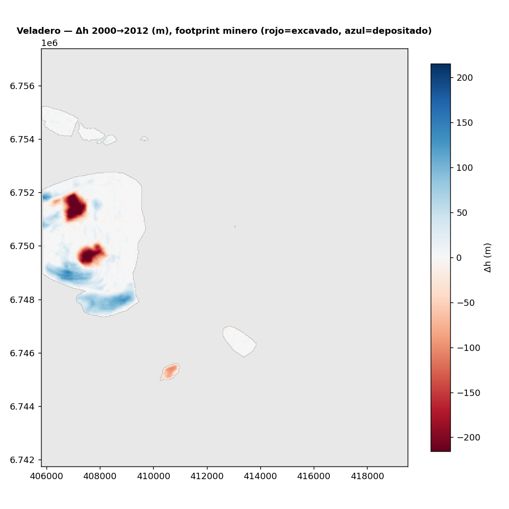

# Resultados

El producto principal es el **mapa de cambio de elevación (Δh)** entre dos fechas y el **volumen** integrado
sobre el pit.

Primer resultado real: **Veladero** (San Juan), comparando **SRTM (feb 2000)** vs **Copernicus GLO-30
(~2012)** — dos DEM **gratuitos**. Como la mina arrancó en 2005, el SRTM capta la montaña prístina y el
GLO-30 el pit ya desarrollado.

## Cambio de elevación (Δh) sobre el footprint minero

<iframe src="../assets/demo_volumen.html" width="100%" height="540" style="border:1px solid #ccc;border-radius:6px"></iframe>

{ loading=lazy }

*Rojo = terreno que bajó (excavado), azul = terreno que subió (depositado). Se distinguen los **dos pits**
(Filón Federico y Amable, −200 a −320 m) y las **escombreras** adyacentes (hasta +150 m). Acotado al footprint
minero de OpenStreetMap.*

## Volumen movido (2000 → 2012)

| Métrica | Valor |
|---|---|
| **Excavado** | **≈ 285 Mm³** |
| **Depositado** | ≈ 267 Mm³ |
| Neto (dep − exc) | ≈ −18 Mm³ |
| Celdas de footprint | 23.130 (~19 km², celda 29×29 m) |
| Co-registro vertical | sesgo −5,06 m removido (mediana de 228.708 celdas estables) |

Que **excavado ≈ depositado** es lo esperable: el material sale del pit y se apila en escombreras dentro del
mismo footprint. Con densidad de roca ~2,5 t/m³, ~285 Mm³ ≈ **700 Mt** de material movido en ~7 años de
operación — del orden de magnitud de lo que reporta una mina de este tamaño (ver [caso público](caso-publico.md)).

!!! warning "Qué tan en serio tomarse el número"
    Es una **estimación de orden de magnitud**, no contabilidad minera. Fuentes de error: (1) el ruido
    vertical de los DEM globales (±2–4 m) integrado sobre el área; (2) el sesgo de geoide/banda entre SRTM
    (EGM96, banda C) y GLO-30 (EGM2008, TanDEM-X), aquí corregido con la mediana del terreno estable; (3) el
    footprint de OSM, que puede no calzar exacto con el límite real. Las mejoras (co-registro x-y-z, barra de
    error) están en [próximos pasos](proximos-pasos.md).
